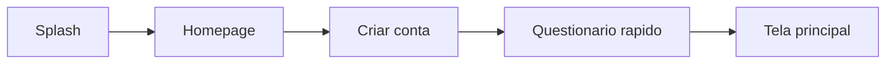
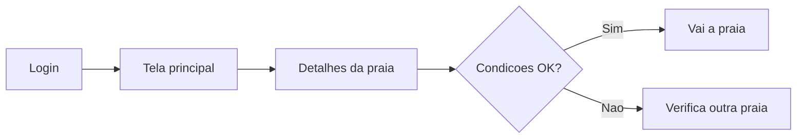
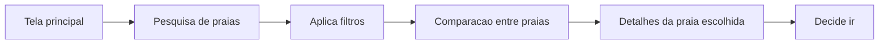
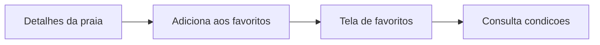
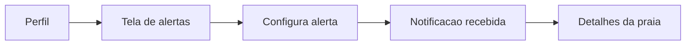
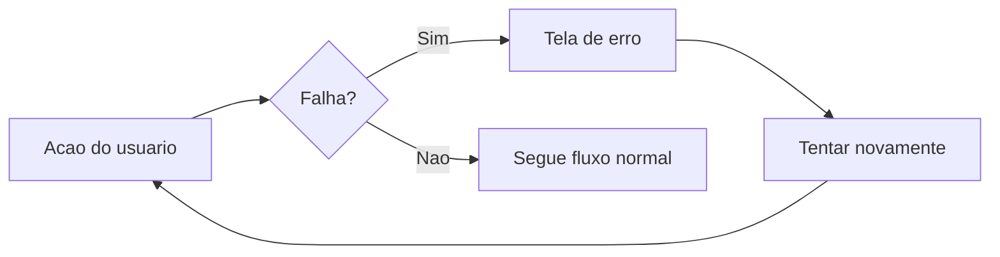

# Fluxo de Usuários — App de Praias

*Jornadas e Casos de Uso (UC)*

Documento derivado da modelagem de telas do aplicativo de monitoramento de praias do Rio de Janeiro, elaborado como insumo direto para os protótipos navegável e funcional.

---

## 1. Fluxo de usuários — Jornadas

Seis jornadas cobrem o fluxo principal e os fluxos secundários já apontados no documento de telas.

### J1 — Onboarding (novo usuário)

Cadastro, coleta de localização/cidade/praias preferidas/transporte e entrada direta no mapa personalizado.

### J2 — Checagem de rotina antes de ir à praia

Usuário habitual confere rapidamente uma praia já conhecida antes de sair de casa.

### J3 — Descoberta e comparação de praias

Usuário indeciso avalia múltiplas opções antes de escolher — fluxo primário de descoberta (tela 4 → 7 → 5).

### J4 — Gerenciar favoritos

Atalho para as praias que o usuário revisita com frequência, evitando pesquisa repetida.

### J5 — Configurar e receber alertas

Usuário delega o monitoramento contínuo ao app (ex.: avisar quando a praia ficar imprópria).

### J6 — Falha / indisponibilidade de dados

Cobre os três cenários previstos na tela 12: dado não encontrado, erro de comunicação e falha de conexão.

---

## 2. Casos de uso (UC)

Cada UC principal representa uma interação completa mapeada às telas. Quando o UC envolve preencher vários campos ou tomar várias decisões em sequência (um formulário, por exemplo), ele é detalhado em sub-casos de uso (`UC0X.1`, `UC0X.2`, ...), que descrevem cada passo isoladamente. Todo UC traz ator, pré-condição, pós-condição, fluxo principal passo a passo e, quando existem, fluxos alternativos/exceções.

### UC01 — Criar conta

- **Ator:** Visitante
- **Pré-condição:** Não possui conta no app
- **Pós-condição:** Conta criada e usuário autenticado; segue automaticamente para UC02

**Fluxo principal**

1. Usuário acessa a Homepage e seleciona "Criar conta".
2. Sistema exibe o formulário de cadastro.
3. Usuário preenche os campos (UC01.1 a UC01.4).
4. Usuário confirma o envio do formulário.
5. Sistema valida os dados (UC01.5) e cria a conta.
6. Sistema encaminha o usuário ao questionário rápido (UC02).

**Sub-casos de uso**

1. **UC01.1 — Informar nome.** Sistema exibe campo de texto "Nome"; usuário digita; sistema valida que o campo não está vazio.
2. **UC01.2 — Informar e-mail.** Sistema exibe campo "E-mail"; usuário digita; sistema valida formato de e-mail e verifica se já existe cadastro com o mesmo e-mail.
3. **UC01.3 — Informar senha.** Sistema exibe campo "Senha" (oculto); usuário digita; sistema valida requisitos mínimos de segurança (tamanho, caracteres).
4. **UC01.4 — Confirmar senha.** Sistema exibe campo "Confirmação de senha"; usuário digita novamente; sistema valida que os dois campos coincidem.
5. **UC01.5 — Validar e enviar cadastro.** Sistema revalida todos os campos em conjunto, criptografa a senha e persiste o novo `Usuario`.

**Fluxo alternativo**

- **A1 (e-mail já cadastrado):** no passo 5, sistema informa que o e-mail já está em uso e mantém o usuário no formulário (UC01.2).
- **A2 (senhas não coincidem):** no passo UC01.4, sistema exibe erro inline e mantém o usuário no campo de confirmação.
- **A3 (campo obrigatório vazio):** sistema bloqueia o envio e destaca o(s) campo(s) pendente(s).

### UC02 — Responder questionário inicial

- **Ator:** Usuário recém-cadastrado
- **Pré-condição:** UC01 concluído
- **Pós-condição:** Preferências salvas em `PreferenciaPraia` e no perfil do `Usuario`; usuário direcionado à tela principal

**Fluxo principal**

1. Sistema exibe o questionário rápido logo após o cadastro.
2. Usuário responde cada pergunta em sequência (UC02.1 a UC02.4).
3. Sistema salva as respostas no perfil do usuário.
4. Sistema exibe a tela principal já personalizada com base nas respostas.

**Sub-casos de uso**

1. **UC02.1 — Conceder permissão de localização.** Sistema solicita permissão do dispositivo; usuário aceita ou recusa.
2. **UC02.2 — Informar cidade onde mora.** Usuário seleciona ou digita a cidade.
3. **UC02.3 — Selecionar praias/postos de preferência.** Usuário marca uma ou mais praias/postos em uma lista ou busca.
4. **UC02.4 — Selecionar meio de transporte.** Usuário escolhe entre as opções disponíveis (ex.: a pé, carro, transporte público).

**Fluxo alternativo**

- **A1 (permissão de localização recusada em UC02.1):** sistema segue o questionário normalmente e usa a cidade informada manualmente (UC02.2) como referência; localização pode ser concedida depois em UC15.
- **A2 (questionário pulado):** se o app permitir pular, sistema usa valores padrão (sem preferências) e o usuário pode configurá-las depois em UC14.

### UC03 — Fazer login

- **Ator:** Usuário cadastrado
- **Pré-condição:** Possui conta ativa
- **Pós-condição:** Sessão iniciada; usuário na tela principal

**Fluxo principal**

1. Usuário acessa a Homepage e seleciona "Login".
2. Usuário preenche os campos (UC03.1 e UC03.2).
3. Usuário confirma o envio.
4. Sistema autentica as credenciais (UC03.3).
5. Sistema abre a tela principal.

**Sub-casos de uso**

1. **UC03.1 — Informar usuário/e-mail.** Usuário digita o e-mail ou nome de usuário cadastrado.
2. **UC03.2 — Informar senha.** Usuário digita a senha (campo oculto).
3. **UC03.3 — Autenticar.** Sistema compara as credenciais com a base de `Usuario`; libera ou nega o acesso.

**Fluxo alternativo**

- **A1 (credenciais inválidas):** sistema exibe mensagem de erro genérica (não especifica se o e-mail ou a senha estão incorretos) e mantém o usuário na tela de login.
- **A2 (esqueci minha senha):** usuário aciona opção de recuperação de senha (fluxo não coberto nas telas atuais — pendente de definição).

### UC04 — Visualizar mapa com condições

- **Ator:** Usuário autenticado
- **Pré-condição:** Área/localização definida (UC15)
- **Pós-condição:** Usuário vê o panorama das praias próximas

**Fluxo principal**

1. Sistema identifica a área de referência do usuário (localização ou cidade preferida).
2. Sistema carrega o mapa centrado nessa área.
3. Sistema sobrepõe as camadas de informação (UC04.1 a UC04.4).
4. Usuário visualiza o mapa e pode tocar em uma praia para abrir UC07.

**Sub-casos de uso**

1. **UC04.1 — Exibir marcadores de condição da água.** Sistema busca a `CondicaoAgua` mais recente de cada `PostoColeta` na área e exibe ícone própria/imprópria/sem informação.
2. **UC04.2 — Exibir monitor de lotação.** Sistema busca o registro mais recente de `Lotacao` por praia e exibe indicador de nível.
3. **UC04.3 — Exibir altura da onda.** Sistema busca o registro `CondicaoClimaMar` do tipo `atual` mais recente e exibe a altura da onda.
4. **UC04.4 — Exibir informações climáticas.** Sistema exibe chuva, vento e demais condições relevantes do registro `atual`.

**Fluxo alternativo**

- **A1 (sem dados recentes):** sistema exibe ícone "sem informação" para a camada afetada, sem bloquear as demais.
- **A2 (falha ao carregar):** segue para UC17.

### UC05 — Pesquisar praia

- **Ator:** Usuário autenticado
- **Pré-condição:** —
- **Pós-condição:** Lista de praias correspondentes é exibida

**Fluxo principal**

1. Usuário acessa a tela de pesquisa.
2. Usuário escolhe o critério de busca e digita o termo (UC05.1 a UC05.4).
3. Sistema consulta as entidades `Praia`/`PostoColeta` correspondentes.
4. Sistema exibe a lista de resultados.

**Sub-casos de uso**

1. **UC05.1 — Pesquisar por nome da praia.**
2. **UC05.2 — Pesquisar por bairro.**
3. **UC05.3 — Pesquisar por cidade.**
4. **UC05.4 — Pesquisar por posto de coleta.**

Em todos os sub-casos, o sistema faz busca textual/parcial e retorna as `Praia` cujo atributo correspondente contenha o termo digitado.

**Fluxo alternativo**

- **A1 (nenhum resultado):** sistema exibe mensagem "nenhuma praia encontrada" e sugere ajustar o termo.

### UC06 — Filtrar pesquisa

- **Ator:** Usuário autenticado
- **Pré-condição:** UC05 realizado (lista de resultados exibida)
- **Pós-condição:** Lista de resultados refinada conforme os filtros ativos

**Fluxo principal**

1. Usuário abre o painel de filtros.
2. Usuário ativa um ou mais filtros (UC06.1 a UC06.4), que podem ser combinados.
3. Sistema reaplica a consulta com os filtros selecionados.
4. Sistema atualiza a lista de resultados.

**Sub-casos de uso**

1. **UC06.1 — Filtrar por balneabilidade.** Usuário escolhe própria/imprópria/sem informação.
2. **UC06.2 — Filtrar por ondas.** Usuário define faixa de altura de onda aceitável.
3. **UC06.3 — Filtrar por condições climáticas.** Usuário escolhe condições desejadas (ex.: sem chuva).
4. **UC06.4 — Filtrar por distância.** Usuário define raio máximo a partir da sua localização.

**Fluxo alternativo**

- **A1 (filtros incompatíveis, sem resultados):** sistema informa que nenhuma praia atende à combinação de filtros e sugere remover algum.

### UC07 — Visualizar detalhes da praia

- **Ator:** Usuário autenticado
- **Pré-condição:** Praia selecionada (a partir do mapa, pesquisa, favoritos ou comparação)
- **Pós-condição:** Usuário tem informação suficiente para decidir se vai à praia

**Fluxo principal**

1. Sistema identifica a praia selecionada.
2. Sistema busca o `PostoColeta` e a `CondicaoAgua` mais recente vinculados.
3. Sistema busca o `CondicaoClimaMar` mais recente do tipo `atual`.
4. Sistema exibe, em uma única tela: data da última checagem, condições do mar, vento, clima do dia, chuva e temperatura.
5. Sistema oferece acesso à previsão (UC08).

**Fluxo alternativo**

- **A1 (sem checagem recente):** sistema exibe a data da última checagem disponível, mesmo que antiga, com aviso de desatualização.
- **A2 (falha ao carregar):** segue para UC17.

### UC08 — Visualizar previsão da praia

- **Ator:** Usuário autenticado
- **Pré-condição:** Praia selecionada
- **Pós-condição:** Usuário avalia condições futuras da praia

**Fluxo principal**

1. Usuário aciona "previsão" a partir de UC07.
2. Sistema busca os registros `CondicaoClimaMar` do tipo `previsao` para os próximos períodos/dias.
3. Sistema exibe a evolução esperada (temperatura, chuva, vento, ondas) por período.

**Fluxo alternativo**

- **A1 (sem previsão disponível):** sistema informa que a previsão não está disponível para aquela praia/período.

### UC09 — Comparar praias

- **Ator:** Usuário autenticado
- **Pré-condição:** Pelo menos duas praias selecionadas
- **Pós-condição:** Usuário escolhe a praia mais adequada e pode abrir UC07

**Fluxo principal**

1. Usuário seleciona duas ou mais praias para comparar (UC09.1).
2. Sistema monta a visualização lado a lado.
3. Sistema preenche cada critério de comparação (UC09.2 a UC09.5).
4. Usuário analisa e escolhe uma praia, indo para UC07.

**Sub-casos de uso**

1. **UC09.1 — Selecionar praias para comparar.** A partir de favoritos, pesquisa ou mapa, usuário marca as praias desejadas.
2. **UC09.2 — Comparar condições da água.**
3. **UC09.3 — Comparar clima.**
4. **UC09.4 — Comparar ondas.**
5. **UC09.5 — Comparar deslocamento.** Sistema estima distância/tempo a partir da localização do usuário e do meio de transporte preferido.

**Fluxo alternativo**

- **A1 (limite de praias excedido):** sistema informa o número máximo de praias comparáveis simultaneamente.

### UC10 — Adicionar praia aos favoritos

- **Ator:** Usuário autenticado
- **Pré-condição:** Praia selecionada e ainda não favoritada
- **Pós-condição:** Praia listada na tela de favoritos

**Fluxo principal**

1. Usuário abre os detalhes de uma praia (UC07).
2. Usuário aciona "adicionar aos favoritos".
3. Sistema cria um registro `Favorito` associando `Usuario` e `Praia`.
4. Sistema atualiza o ícone/estado do botão para indicar que a praia já é favorita.

**Fluxo alternativo**

- **A1 (praia já favoritada):** ação é ignorada; sistema mantém o estado atual.

### UC11 — Remover praia dos favoritos

- **Ator:** Usuário autenticado
- **Pré-condição:** Praia está na lista de favoritos
- **Pós-condição:** Praia removida da lista de favoritos

**Fluxo principal**

1. Usuário acessa a tela de favoritos ou os detalhes da praia.
2. Usuário aciona "remover dos favoritos".
3. Sistema exclui o registro `Favorito` correspondente.
4. Sistema atualiza a lista/ícone.

### UC12 — Configurar alerta

- **Ator:** Usuário autenticado
- **Pré-condição:** —
- **Pós-condição:** Alerta criado e monitorado pelo sistema (UC13 passa a poder ocorrer)

**Fluxo principal**

1. Usuário acessa a tela de alertas.
2. Usuário aciona "novo alerta".
3. Usuário configura o alerta (UC12.1 e UC12.2).
4. Usuário ativa o alerta (UC12.3).
5. Sistema salva o registro `Alerta` e passa a monitorar a condição.

**Sub-casos de uso**

1. **UC12.1 — Selecionar praia (opcional).** Usuário escolhe uma praia específica ou deixa em branco para um alerta geral.
2. **UC12.2 — Selecionar tipo de alerta.** Usuário escolhe entre "praia ficar imprópria", "chuva intensa" ou "avisos importantes".
3. **UC12.3 — Ativar/desativar alerta.** Usuário liga ou desliga o alerta configurado, a qualquer momento.

### UC13 — Receber notificação de alerta

- **Ator:** Sistema (para o Usuário com alerta ativo)
- **Pré-condição:** Alerta ativo (UC12) e condição monitorada ocorreu
- **Pós-condição:** Usuário é direcionado aos detalhes da praia (UC07)

**Fluxo principal**

1. Sistema detecta, em segundo plano, que a condição monitorada por um `Alerta` ativo ocorreu (ex.: nova `CondicaoAgua` = imprópria).
2. Sistema dispara notificação ao usuário.
3. Usuário toca na notificação.
4. Sistema abre os detalhes da praia relacionada (UC07).

**Fluxo alternativo**

- **A1 (usuário ignora a notificação):** notificação permanece disponível no histórico/central de notificações do dispositivo.

### UC14 — Editar perfil e preferências

- **Ator:** Usuário autenticado
- **Pré-condição:** —
- **Pós-condição:** Dados do perfil atualizados

**Fluxo principal**

1. Usuário acessa a tela de perfil.
2. Usuário seleciona o que deseja editar (UC14.1 a UC14.5).
3. Sistema salva as alterações no `Usuario` (e entidades relacionadas).

**Sub-casos de uso**

1. **UC14.1 — Editar nome.**
2. **UC14.2 — Editar cidade/estado.**
3. **UC14.3 — Gerenciar praias favoritas.** Atalho que reaproveita UC10/UC11.
4. **UC14.4 — Gerenciar alertas.** Atalho que reaproveita UC12.
5. **UC14.5 — Editar preferências de condição da praia.** Atualiza `PreferenciaPraia` e critérios usados para personalizar o app.

### UC15 — Definir localização

- **Ator:** Usuário autenticado
- **Pré-condição:** —
- **Pós-condição:** Localização usada para personalizar mapa, distância e filtros

**Fluxo principal**

1. Usuário acessa "Localização" no perfil.
2. Usuário escolhe uma das opções (UC15.1 ou UC15.2).
3. Sistema salva a preferência e passa a usá-la no mapa (UC04) e nos filtros de distância (UC06.4).

**Sub-casos de uso**

1. **UC15.1 — Usar localização do celular.** Sistema solicita permissão de GPS e usa a posição em tempo real.
2. **UC15.2 — Definir localização padrão.** Usuário escolhe manualmente uma cidade/bairro como referência fixa.

**Fluxo alternativo**

- **A1 (permissão de GPS negada em UC15.1):** sistema mantém ou solicita a localização padrão (UC15.2).

### UC16 — Consultar FAQ

- **Ator:** Usuário (autenticado ou não)
- **Pré-condição:** —
- **Pós-condição:** Dúvida esclarecida sem contato externo

**Fluxo principal**

1. Usuário acessa a tela de FAQ.
2. Usuário navega pelas categorias ou busca uma palavra-chave.
3. Sistema exibe a(s) pergunta(s) correspondente(s) com a resposta.

**Fluxo alternativo**

- **A1 (nenhuma pergunta encontrada):** sistema sugere tópicos relacionados ou canal de contato.

### UC17 — Tratar erro do sistema

- **Ator:** Sistema (para qualquer Usuário)
- **Pré-condição:** Ocorre falha ao executar outro UC
- **Pós-condição:** Usuário retoma o fluxo ou é informado claramente da indisponibilidade

**Fluxo principal**

1. Sistema detecta que uma operação não pode ser concluída (UC17.1 a UC17.3).
2. Sistema exibe mensagem clara explicando o problema.
3. Sistema oferece ação de "tentar novamente", quando aplicável.
4. Usuário tenta novamente ou abandona o fluxo.

**Sub-casos de uso**

1. **UC17.1 — Dado não encontrado.** Ex.: praia ou posto consultado não existe ou foi removido.
2. **UC17.2 — Erro de comunicação com o servidor.** Ex.: API/backend indisponível ou retorna erro.
3. **UC17.3 — Falha de conexão com a internet.** Dispositivo sem conectividade.

---

## 3. UC por jornada

| Jornada | UCs envolvidos |
| --- | --- |
| J1 — Onboarding | UC01, UC02 |
| J2 — Checagem de rotina | UC03, UC04, UC07 |
| J3 — Descoberta e comparação | UC05, UC06, UC09, UC07 |
| J4 — Favoritos | UC10, UC11, UC07 |
| J5 — Alertas | UC12, UC13, UC07 |
| J6 — Falha/indisponibilidade | UC17 |

UC08, UC14, UC15 e UC16 são transversais (podem ocorrer a partir de mais de uma jornada) e não foram amarrados a uma única linha da tabela acima.
</content>
