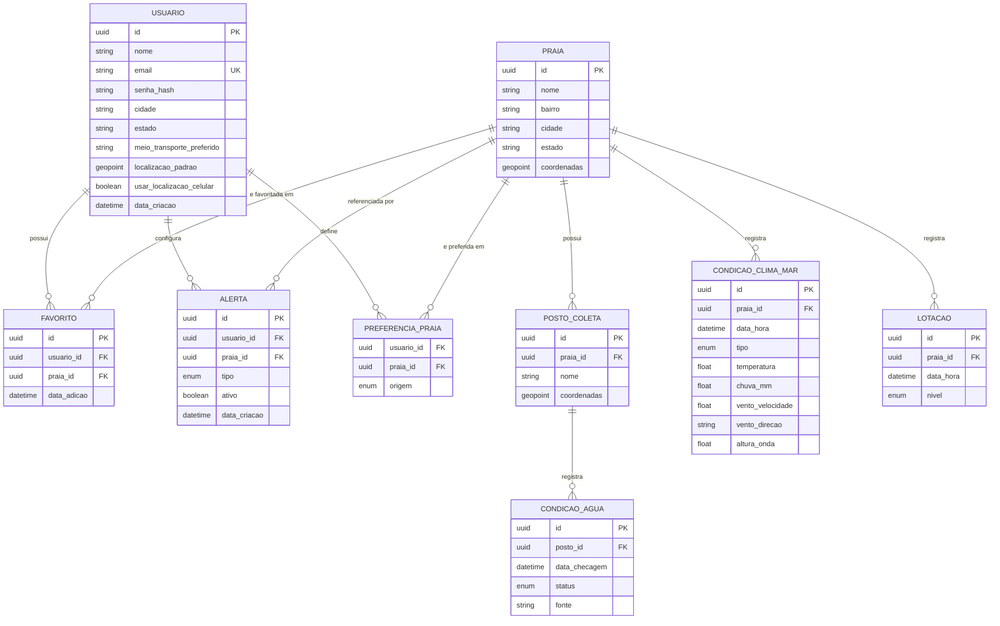

# Modelagem de Dados — App de Praias

Documento derivado da modelagem de telas do aplicativo de monitoramento de praias do Rio de Janeiro, elaborado como insumo direto para os protótipos navegável e funcional.

---

## 1. Entidades e telas de origem

| Entidade | Origem nas telas | Propósito |
| --- | --- | --- |
| `Usuario` | 2.1, 2.2, 2.3, 10 | Conta, credenciais e preferências coletadas no cadastro/questionário |
| `Praia` | 3, 4, 5, 7, 8 | Cadastro base de praias (nome, localização) |
| `PostoColeta` | 3, 5 | Ponto oficial de coleta de amostra de água vinculado a uma praia (uma praia pode ter mais de um posto) |
| `CondicaoAgua` | 3, 5 | Histórico de balneabilidade (própria/imprópria/sem informação) por posto |
| `CondicaoClimaMar` | 3, 5, 6 | Registros de clima/mar, tanto medições atuais quanto previsões futuras (`tipo`) |
| `Lotacao` | 3 | Nível de lotação da praia em um instante |
| `Favorito` | 8 | Associação usuário-praia salva |
| `Alerta` | 9 | Regras de notificação configuradas pelo usuário |
| `PreferenciaPraia` | 2.3, 10 | Praias marcadas como preferência no questionário inicial ou no perfil |

### Detalhamento dos atributos

**`Usuario`**
- `id` (PK)
- `nome`
- `email` (único)
- `senha_hash`
- `cidade`
- `estado`
- `meio_transporte_preferido`
- `localizacao_padrao` (geopoint)
- `usar_localizacao_celular` (booleano)
- `data_criacao`

**`Praia`**
- `id` (PK)
- `nome`
- `bairro`
- `cidade`
- `estado`
- `coordenadas` (geopoint)

**`PostoColeta`**
- `id` (PK)
- `praia_id` (FK → `Praia`)
- `nome`
- `coordenadas` (geopoint)

**`CondicaoAgua`**
- `id` (PK)
- `posto_id` (FK → `PostoColeta`)
- `data_checagem`
- `status` (`propria` | `impropria` | `sem_informacao`)
- `fonte` (ex.: INEA)

**`CondicaoClimaMar`**
- `id` (PK)
- `praia_id` (FK → `Praia`)
- `data_hora`
- `tipo` (`atual` | `previsao`)
- `temperatura`
- `chuva_mm`
- `vento_velocidade`
- `vento_direcao`
- `altura_onda`

**`Lotacao`**
- `id` (PK)
- `praia_id` (FK → `Praia`)
- `data_hora`
- `nivel` (`baixa` | `media` | `alta`)

**`Favorito`**
- `id` (PK)
- `usuario_id` (FK → `Usuario`)
- `praia_id` (FK → `Praia`)
- `data_adicao`

**`Alerta`**
- `id` (PK)
- `usuario_id` (FK → `Usuario`)
- `praia_id` (FK → `Praia`, opcional/nullable)
- `tipo` (`impropria` | `chuva_intensa` | `aviso`)
- `ativo` (booleano)
- `data_criacao`

**`PreferenciaPraia`** (associativa N:M)
- `usuario_id` (FK → `Usuario`)
- `praia_id` (FK → `Praia`)
- `origem` (`questionario` | `manual`)

---

## 2. Chaves e tipos de dados

Antes do diagrama, um glossário rápido dos termos usados nas entidades abaixo.

### 2.1 Chaves

- **PK (Primary Key / chave primária):** campo que identifica de forma única cada registro de uma entidade. Não se repete nem fica vazio — é o "número de identidade" daquele registro. Ex.: `Praia.id` identifica uma praia específica.
- **FK (Foreign Key / chave estrangeira):** campo que aponta para a PK de outra entidade, criando a relação entre elas. Ex.: `PostoColeta.praia_id` guarda o `id` (PK) da `Praia` à qual aquele posto pertence — assim o sistema sabe "esse posto é dessa praia" sem duplicar os dados da praia dentro do posto.
- **UK (Unique Key / chave única):** campo que também não pode se repetir entre os registros, mas, diferente da PK, não identifica o registro nem é usado por FKs de outras entidades para se relacionar com ele. Ex.: `Usuario.email` é UK — o sistema não permite dois usuários com o mesmo e-mail, mas quem identifica o usuário internamente (e é referenciado pelas FKs, como `Favorito.usuario_id`) continua sendo `Usuario.id`, não o e-mail.

Exemplo prático de PK + FK juntas: a entidade `Favorito` não guarda o nome do usuário nem o nome da praia — só duas FKs (`usuario_id` e `praia_id`), que juntas ligam "este usuário" a "esta praia".

### 2.2 Tipos de dados

| Tipo | Significado | Onde aparece no modelo |
| --- | --- | --- |
| `uuid` | *Universally Unique Identifier*: identificador único gerado aleatoriamente (128 bits), usado como PK. Evita depender de um contador sequencial e não colide mesmo gerado em sistemas/dispositivos diferentes. | `id` de todas as entidades |
| `string` | Texto livre. | `nome`, `bairro`, `fonte`, etc. |
| `boolean` | Valor verdadeiro/falso (true/false), para estados binários (ligado/desligado, sim/não). | `usar_localizacao_celular`, `ativo` |
| `datetime` | Data e hora (timestamp) de quando algo aconteceu ou foi registrado. | `data_criacao`, `data_hora`, `data_checagem` |
| `float` | Número decimal, usado em medidas. | `temperatura`, `altura_onda`, `vento_velocidade`, `chuva_mm` |
| `enum` (*enumeration*) | Conjunto fechado de valores pré-definidos: o campo só aceita um valor dessa lista, nunca um valor arbitrário. | `status` (`propria`/`impropria`/`sem_informacao`), `tipo`, `nivel`, `origem` |
| `geopoint` | Par de coordenadas geográficas (latitude/longitude), usado para localizar praias, postos e o usuário no mapa. | `coordenadas`, `localizacao_padrao` |

---

## 3. Diagrama ER

---

## 4. Decisões de modelagem

- **`PostoColeta` foi separado de `Praia`** porque a balneabilidade é medida por ponto de coleta oficial (ex.: padrão INEA), e uma praia longa pode ter vários postos com status diferentes ao mesmo tempo — os marcadores da tela 3 (mapa) refletem isso diretamente.
- **`CondicaoClimaMar` cobre tanto a leitura atual quanto a previsão futura** por meio do campo `tipo` (`atual` | `previsao`), evitando duplicar entidades entre as telas 3 (mapa), 5 (detalhes) e 6 (previsão).
- **`ALERTA.praia_id` é opcional**: um alerta pode ser específico de uma praia ou geral (ex.: "avisos importantes", tela 9).
- **`PREFERENCIA_PRAIA` é N:M** porque tanto o questionário inicial (2.3) quanto o perfil (10) permitem mais de uma praia de preferência; é diferente de `Favorito`, que representa uma ação explícita de salvar (tela 8), não uma preferência declarada no onboarding.
- **Todos os campos de localização usam um tipo `geopoint`** (latitude/longitude) para suportar mapa, distância e filtros de proximidade (tela 4).
- **Histórico versus estado atual:** `CondicaoAgua`, `CondicaoClimaMar` e `Lotacao` guardam séries temporais (um registro por checagem/medição), e não um campo único sobrescrito — isso permite exibir "data da última checagem" (tela 5) e construir a previsão (tela 6) a partir do mesmo modelo.
</content>
